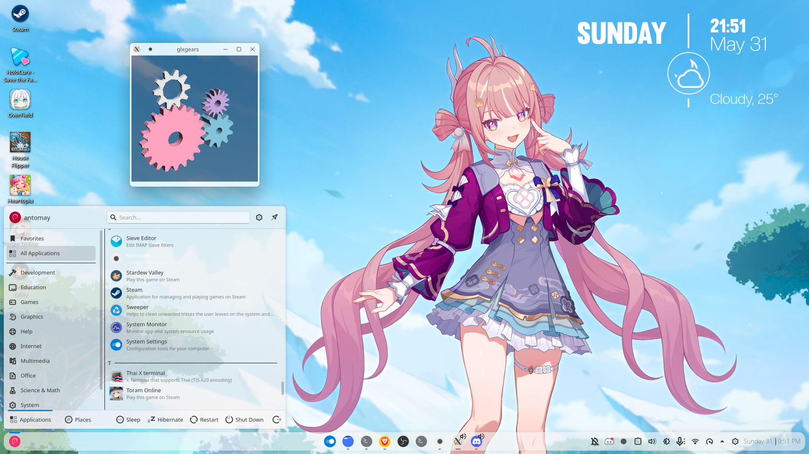
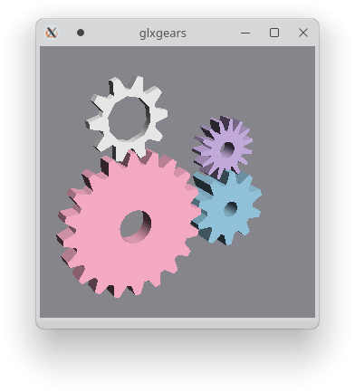

# glxgears - Pastel Sky Edition ⚙️☁️

Modifikasi estetis dari aplikasi klasik `glxgears`, dirancang khusus untuk mempercantik *ricing* desktop Linux.

---

## 📸 Preview




---

## ✨ Fitur Utama
* 🎨 **Palet Warna Pastel:** Menggunakan perpaduan *Pastel Pink*, *Sky Blue*, *Soft White*, dan *Lilac*.
* ⚙️ **4 Roda Gigi (Gears):** Tambahan satu roda gigi ekstra dengan rasio putaran matematika presisi agar tersinkronisasi dan saling menggigit sempurna.
* 🪟 **Latar Transparan:** Memaksa X11/XWayland menggunakan jendela ARGB 32-bit (Alpha Channel) untuk memberikan efek latar belakang kaca gelap transparan.

---

## 🛠️ Cara Instalasi & Menjalankan

Pastikan kamu sudah menginstal pustaka *compiler* dasar (`build-essential`, `libgl1-mesa-dev`, `libx11-dev`). Buka terminal dan jalankan perintah berikut secara berurutan:

```bash
# 1. Kloning repositori ini
git clone [https://github.com/AntoMay/glxgears-pastelsky.git](https://github.com/AntoMay/glxgears-pastelsky.git)

# 2. Masuk ke dalam direktori
cd glxgears-pastelsky

# 3. Kompilasi kode program
gcc glxgears.c -o glxgears_kustom -lGL -lX11 -lm

# 4. Jalankan aplikasi
./glxgears_kustom
